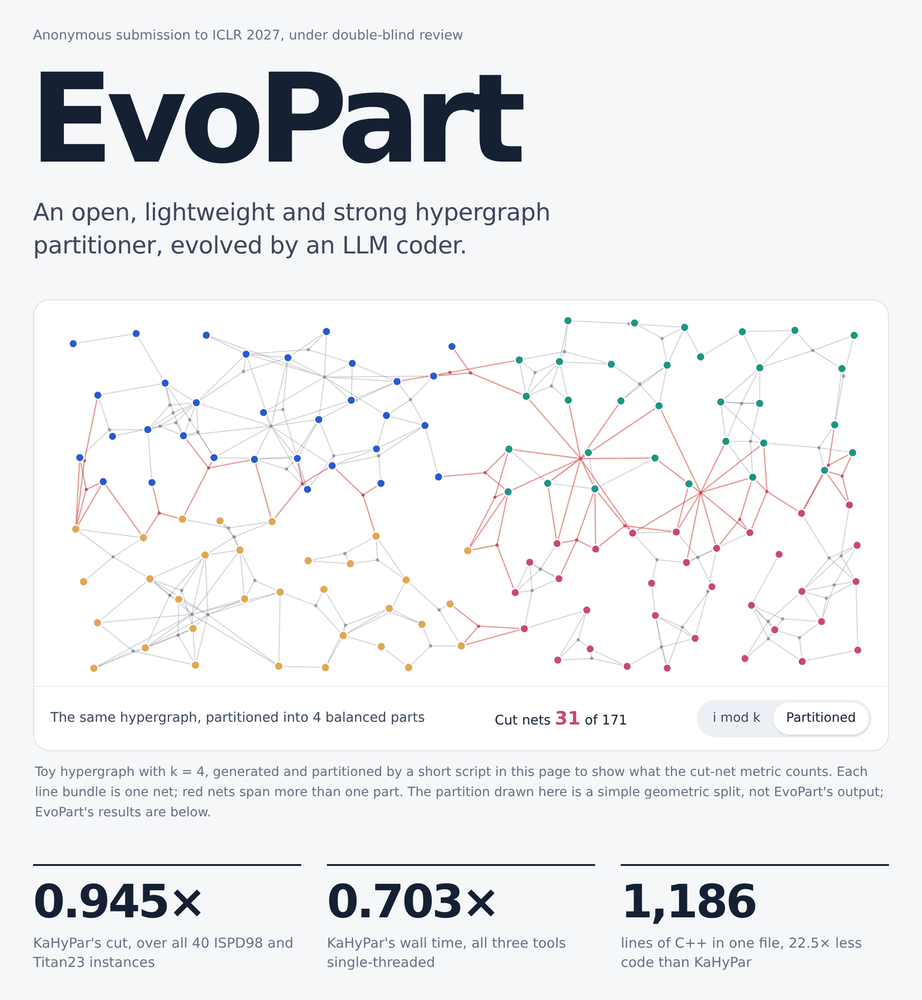

# EvoPart: An Open, Lightweight, and Strong Hypergraph Partitioner Evolved with LLM Coder

**Project page:** open [`index.html`](index.html) (also in the file list above). It renders as a static page by
default; click the **JS off** button at the top right of the file view (it then shows **JS on**) for the
interactive version, or download [`index.html`](index.html) and open it in a browser.

* `EvoPart/` - the evolved partitioner: one C++ file (1,186 lines excluding comments and blank lines), single-threaded, with a makefile.
* `OpenEvolve/` - the OpenEvolve framework (https://github.com/algorithmicsuperintelligence/openevolve)
  together with the example that produced EvoPart, `OpenEvolve/examples/hypergraph_partitioning/`. The ISPD98 and Titan23
  hypergraphs are not included; see `OpenEvolve/examples/hypergraph_partitioning/README.md`.

See the README in each directory.
